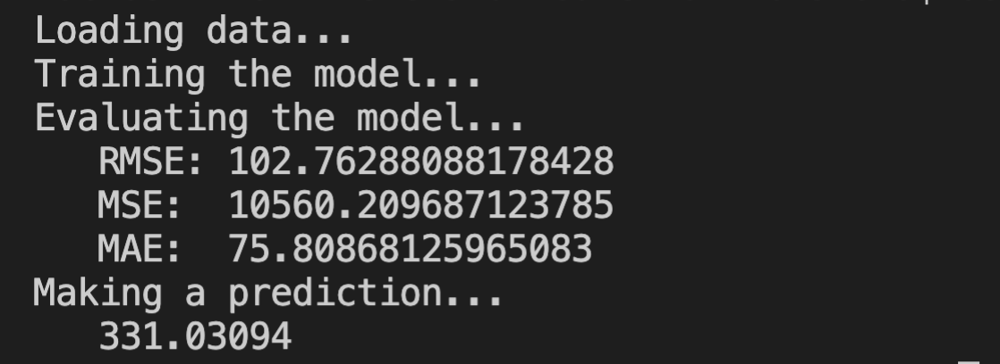
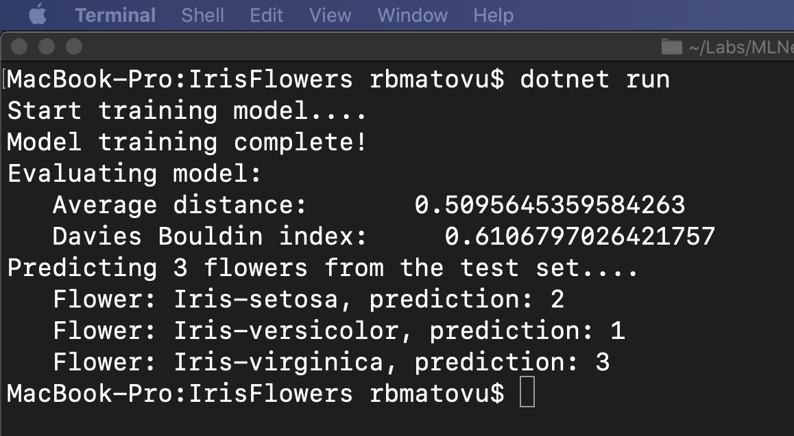

# MLNetCourseWork
Data Science With C# And ML.NET Course Assignments

## Assignment 1: Loading Data
This assignment illustrates various data cleaning techniques including:
* Scaling / normalizing numeric units to lower (natural) ranges to help our model converge quickly to a solution
* One-hot encoding
* Binning for geo-date

## Assignment 2: Heart Disease Binary Classifier
This assignment illustrates a binary classifier used to predict prevalence of heart disease symptoms.

## Assignment 3: House Price Prediction

## Assignment 4: Fraud Detection

## Assignment 5: Digit / Handwritten Character Recognition
This assignment involves taking the MNIST dataset and creating a model that can predict handwritten characters.

## Assignment 6: Spam Detection
In this assignment, I use the *K-Fold Cross Validation* technique to ensure that the size of the dataset is sufficient for building out this model. The target for this determination is an average AUC (Area Under the Curve) of > 0.8. See below:

On training and evaluating the model, we get the following results:

### Result Descriptions
* Accuracy: this is the number of correct predictions divided by the total number of predictions.
* AreaUnderRocCurve: a metric that indicates how accurate the model is: 0 = the model is wrong all the time, 0.5 = the model produces random output, 1 = the model is correct all the time. An AUC of 0.8 or higher is considered good.
* AreaUnderPrecisionRecallCurve: an alternate AUC metric that performs better for heavily imbalanced datasets with many more negative results than positive.
* F1Score: this is a metric that strikes a balance between Precision and Recall. It’s useful for imbalanced datasets with many more negative results than positive.
* LogLoss: this is a metric that expresses the size of the error in the predictions the model is making. A logloss of zero means every prediction is correct, and the loss value rises as the model makes more and more mistakes.
* LogLossReduction: this metric is also called the Reduction in Information Gain (RIG). It expresses the probability that the model’s predictions are better than random chance.
* PositivePrecision: also called ‘Precision’, this is the fraction of positive predictions that are correct. This is a good metric to use when the cost of a false positive prediction is high.
* PositiveRecall: also called ‘Recall’, this is the fraction of positive predictions out of all positive cases. This is a good metric to use when the cost of a false negative is high.
* NegativePrecision: this is the fraction of negative predictions that are correct.
* NegativeRecall: this is the fraction of negative predictions out of all negative cases.

## Case Study: Detecting Toxic Comments
// Case study still incomplete
In this case study, I build a model that flags toxic comments (rude, disrespectful or likely to make someone leave) in a discussion. Using a dataset from Wikipedia's page comments downloaded from kaggle.com. Here's a description of the categories:
* toxic: 1 if the comment is toxic, 0 if it is not
* severe_toxic: 1 if the comment is severely toxic, 0 if it is not
* obscene: 1 if the comment is obscene, 0 if it is not
* threat: 1 if the comment is threatening, 0 if it is not
* insult: 1 if the comment is insulting, 0 if it is not
* identity_hate: 1 if the comment expresses identity hatred, 0 if it does not

### Notes
In *multi-class classification*, we have one basic assumption that our data can belong to only one label out of all the labels we have. For example, a given picture of a fruit may be an apple, orange or guava only and not a combination of these.

In *multi-label classification*, data can belong to more than one label simultaneously. For example, in our case a comment may be toxic, obscene and insulting at the same time. It may also happen that the comment is non-toxic and hence does not belong to any of the six labels.

## Assignment 7: Predicting Titanic Survivors
In this assignment, I attempt to predict survivors on the titanic. This assignment alo includes a Jupyter notebook to illustrate new feature support for Jupyter Notebooks in .Net.

## Assignment 8: Predicting Bike Demand
In this assignment, I attempt to predict the demand for bikes in Washington DC. We use The FastForest learner algorithm to train the model. This algorithm uses gradient boosting to build a forest of weak decision trees.

"Gradient boosting builds a stack of weak decision trees. It starts with a single weak tree that tries to predict the bike demand. Then it adds a second tree on top of the first one to correct the error in the first tree. And then it adds a third tree on top of the second one to correct the output of the second tree. And so on."

Below is a description of the Features in the dataset:
* Instant: the record index
* Date: the date of the observation
* Season: the season (1 = springer, 2 = summer, 3 = fall, 4 = winter)
* Year: the year of the observation (0 = 2011, 1 = 2012)
* Month: the month of the observation ( 1 to 12)
* Hour: the hour of the observation (0 to 23)
* Holiday: if the date is a holiday or not
* Weekday: the day of the week of the observation
* WorkingDay: if the date is a working day
* Weather: the weather during the observation (1 = clear, 2 = mist, 3 = light snow/rain, 4 = heavy rain)
* Temperature : the normalized temperature in Celsius
* ATemperature: the normalized feeling temperature in Celsius
* Humidity: the normalized humidity
* Windspeed: the normalized wind speed
* Casual: the number of casual bike users at the time
* Registered: the number of registered bike users at the time
* Count: the total number of rental bikes in operation at the time

## Assignment 9: Iris Flower Clustering

